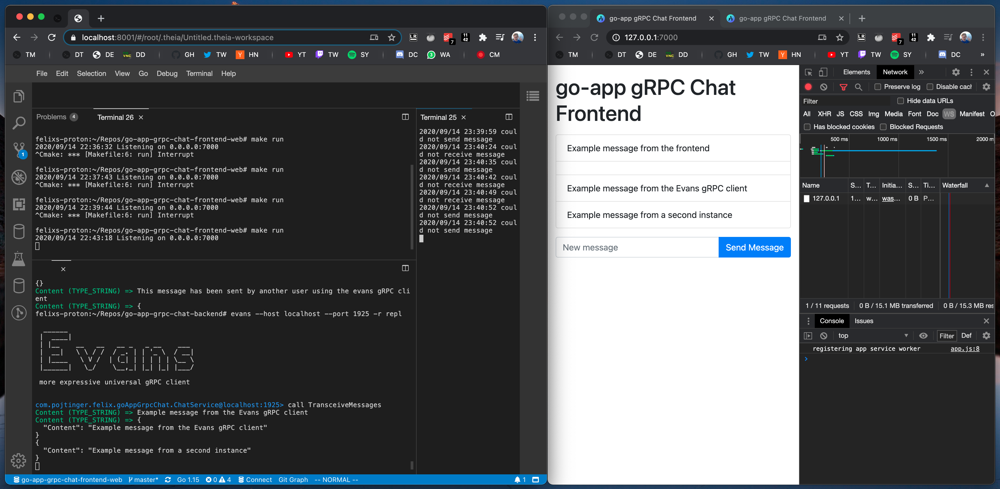

# go-app-grpc-chat-frontend-web

Web frontend for an example chat application using the `go-app` package and gRPC over WebSockets (like gRPC-Web). See [pojntfx/go-app-grpc-chat-backend](https://github.com/pojntfx/go-app-grpc-chat-backend) for the example backend.



## Overview

`go-app-grpc-chat-frontend-web` is a short example showing the use of the [go-app](https://github.com/maxence-charriere/go-app) package and [gRPC](https://grpc.io/) in a Progressive Web Application. There is full bi-directional streaming support and automatic reconnection has been set up.

## Installation

Clone the repository.

A Go package (for documentation) [is available](https://pkg.go.dev/mod/github.com/pojntfx/go-app-grpc-chat-frontend-web).

## Usage

```bash
make
make run
```

Now point your browser to [http://localhost:7000](http://localhost:7000).

## License

go-app-grpc-chat-frontend-web (c) 2020 Felicitas Pojtinger

SPDX-License-Identifier: AGPL-3.0
